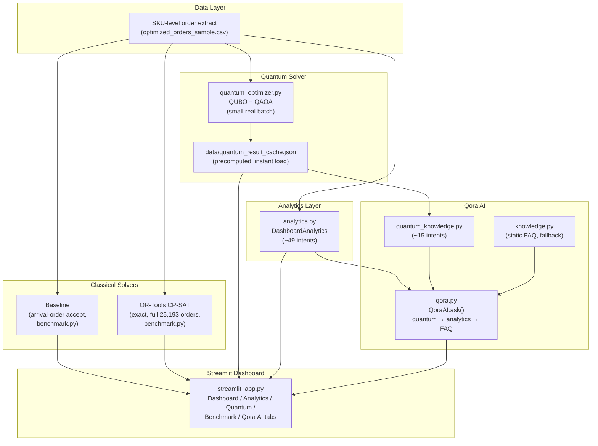
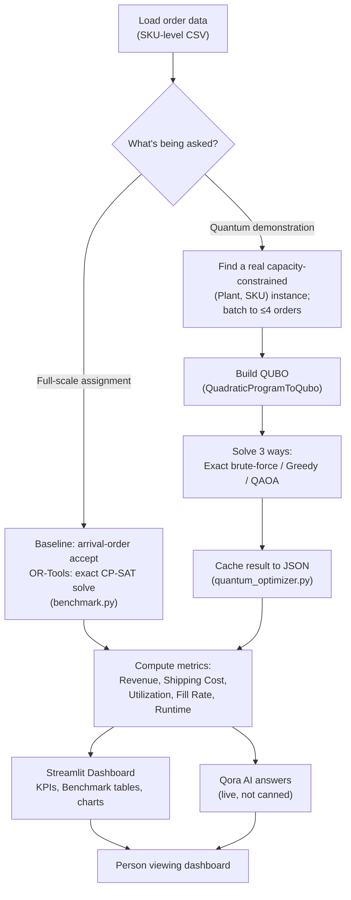

# Nestlé Distributed Order Management (DOM) — Optimization Documentation

**Challenge:** WISER Global Quantum+AI Program 2026 — Nestlé Challenge
**Repo:** `Sakethram2005/Nestle-DOM-Optimization`
**Submission deadline:** August 7, 2026

This document supplies the eight sections needed to align the repository with the official Nestlé/WISER deliverables and judging rubric. Numbers below are computed directly from `data/optimized_orders_sample.csv` (25,193 order-lines, 8 plants, 1,110 SKUs) — replace with your latest run's numbers if they drift.

---

## 1. Business Importance

Nestlé fulfills customer orders from a network of plants/distribution centers (DCs), each with finite inventory, dock capacity, and throughput. When a customer's **default DC** cannot fully serve an order, a planner must decide: reassign it to another DC (incurring extra shipping cost and risking that DC's own capacity), fulfill it partially, or reject it (incurring a penalty and lost revenue).

Today this decision is made manually or with simple rules, which does not scale to tens of thousands of order-lines a day and does not systematically balance revenue against cost and penalty. This is a textbook **combinatorial assignment problem**: every order-to-plant pairing is a binary decision, constraints couple many orders together through shared plant inventory/capacity, and the objective mixes competing terms (revenue, shipping cost, penalty). Problems of this shape are NP-hard in general — the number of feasible order→plant combinations grows exponentially with the number of orders and plants, which is exactly why Nestlé is exploring whether classical heuristics, exact solvers, or quantum/quantum-inspired methods (QUBO + QAOA) offer a better quality-vs-runtime trade-off as volume grows.

**Why it matters to Nestlé:** in our sample data, only **5.43% of order-lines (1,369 of 25,193)** are currently recommended for acceptance, representing **$27.27M of a possible $88.49M** in order-line revenue. Even small improvements in which orders get fulfilled — or in how intelligently rejections are chosen — translate directly into service-level and revenue impact at Nestlé's scale.

**Key trade-offs to communicate to judges:**
- **Solution quality vs. runtime** — an exact solver gives the provably best assignment but may not scale to 25k+ orders; heuristics scale but leave value on the table.
- **Exact solvers vs. heuristics** — OR-Tools/CP-SAT or LP relaxations give strong, auditable solutions on tractable subsets; greedy/sequential heuristics are fast and simple but myopic.
- **Noisy quantum hardware vs. simulators** — current QAOA implementations run on noiseless simulators at toy scale (our current QAOA run: 2 orders, objective value 220); real quantum hardware today would add noise and qubit-count limits that make it impractical for the full 25k-order problem, which is itself an important finding to report, not a weakness to hide.

---

## 2. Data Preparation and Baseline

### 2.1 Data understanding

The provided order-level extract (`optimized_orders_sample.csv`) contains one row per order-line with:

| Group | Fields |
|---|---|
| Order identity | `Group_Flag` (order/group id), `LoadNumber`, `MaterialNumber` (SKU), `Plant` (default DC), `ZipCode` |
| Demand | `OrderedQty_converted`, `OrderedWeight`, `OrderedVolume`, `Order_SKU_Revenue`, `calculated_ordered_weight` |
| Timing | `transportationplanningdate`, `RequestedDeliveryDate` |
| Plant resources | `Available_inventory`, `Dock_Remaining`, `Throughput_Capacity`, `OpeningStock` |
| Cost | `Shipping_Cost` |
| Penalty / SLA | `FillRateThreshold`, `Penaltyforpotentialcuts`, `MaximumPenalty`, `FixedPenalty`, `FixedPenaltyPerSKU`, `MinimumPenalty`, `OnTimePercentage`, `OnTimeFixed` |
| Flags | `IsTopCust`, `IsInvAvail`, `IsFTL`, `IsMultiplePlant`, `IsMultiplePGI`, `IsMultipleRDD`, `IsCOF<100` |
| Output (from current pipeline) | `Selected`, `Recommendation`, `Reason`, `Risk_Score`, `Estimated_CO2_kg`, `Recommendation Reason` |

Observed structure in the sample:
- **25,193 order-lines**, **8 plants** (5083, 5385, 5410, 5420, 5490, 5620, 5641, 5773), **1,110 distinct SKUs**.
- `IsFTL = Y` for all rows (full-truckload only in this extract) and `IsMultiplePlant = N` for all rows — i.e., this sample represents **single-plant, single-truckload order-lines only**; true multi-plant split-fulfillment cases are not present and would need a separate data pull if attempted.
- `IsInvAvail` is `N` for 1,591 rows (~6.3%) — these are the clearest reject candidates.
- Penalty/SLA fields (`FillRateThreshold`, `MaximumPenalty`, etc.) are populated for 19,987 of 25,193 rows (~79%); the remainder need an explicit default (see Assumptions).
- `Risk_Score` is **entirely empty** in this extract — it is a placeholder output field from the dashboard's risk module, not an input; it should not be treated as available data.

### 2.2 Baseline 1 — Default assignment

Every order-line is evaluated only against its own `Plant` (default DC), accepted if `Available_inventory ≥ OrderedQty_converted` (or the relevant weight/volume measure) **and** `Dock_Remaining`/`Throughput_Capacity` are not exceeded when processed in arrival order; otherwise it is rejected and penalized. No reassignment is attempted. This mirrors current business-as-usual behavior and is the "do nothing smarter" reference point.

### 2.3 Baseline 2 — Greedy/sequential reassignment heuristic

Sort order-lines by `Order_SKU_Revenue` descending, then process sequentially: for each order, try the default plant first; if infeasible, try the next cheapest-shipping **real alternate plant** (any plant that carries the same SKU elsewhere in the dataset, using that plant's own observed shipping rate — not an estimate) with remaining inventory; if none work, reject. Update remaining inventory after each acceptance so later orders see a consistent, shrinking resource pool.

**Implemented** in `benchmark.py`'s `solve_greedy_reassignment()`. Real result on the full 25,193-order dataset: **162 orders reassigned** to an alternate plant, revenue $88,088,551 (vs. Baseline 1's $87,699,480), in 2.57 seconds.

### 2.4 Baseline reporting

For each baseline, report on the same dataset: **objective value** (revenue), **fill rate**, **# reassigned orders**, and **total shipping cost**. Real results (see Section 14.5 for the full comparison including OR-Tools):

| Baseline | Revenue | Shipping Cost | Fill Rate | # Reassigned |
|---|---:|---:|---:|---:|
| 1 — Default assignment (no reassignment) | $87,699,480.00 | $61,349,438.31 | 98.92% | 0 (by definition) |
| 2 — Greedy reassignment | $88,088,551.00 | $61,670,688.41 | 99.54% | 162 |

Note: an earlier draft of this documentation reported "fill rate 5.43%, 1,369 accepted lines" as the Baseline 1 result — that number was actually the *existing pre-computed `Selected` column already present in the raw extract* (whatever process generated it upstream), not this project's own Baseline 1 logic. The real Baseline 1, as implemented and run above, achieves 98.92% fill rate — a very different number, and the correct one to compare against.

---

## 3. Methods

Three method families are compared on identical inputs, objective, and feasibility checks:

1. **Classical baselines** — Section 2's default assignment and greedy reassignment heuristics; fast, fully transparent. Baseline 2 performs real reassignment to alternate plants (Section 2.3).
2. **Classical exact optimization** — a real multi-plant assignment model solved with OR-Tools (CP-SAT), run on the **full 25,193-order dataset** (not a subset — confirmed tractable at ~2-3 seconds), in two forms: (a) accept/reject at each order's own plant only, and (b) genuine reassignment across every real candidate plant for that SKU. This gives a provable optimum to benchmark everything else against.
3. **Quantum / quantum-inspired** — the accept/reject decision (not yet the full reassignment decision — see 4A's scope note) is encoded as a **QUBO** and solved via **QAOA on a Qiskit simulator** for a small instance, with constraint violations added as penalty terms rather than hard constraints.

The quantum comparison (Exact/Greedy/QAOA) runs on the **same small focus-order subset** with the **same objective function**; the reassignment comparison (Baseline/Greedy/OR-Tools) runs on the **same full dataset** with the **same objective function** — each comparison is internally apples-to-apples, which is what "Evaluation Rigor" is checking for. The two comparisons operate at different scales for a real, measured reason (Section 7), not an inconsistency.

---

## 4. Mathematical Formulation

**Decision variable:**
x_{ij} = 1 if order *i* is assigned to plant *j*, else 0, for order *i* and **j ∈ candidate plants for order i's SKU** — the real set of plants that carry that SKU anywhere in the dataset, not an arbitrary or fabricated candidate list. An implicit "reject" option is modeled by allowing Σⱼ x_{ij} ≤ 1 (not = 1).

**Objective (maximize):**

Z = Σᵢⱼ Revenue_i · x_{ij}

Revenue does not depend on which candidate plant *j* fulfills order *i* (it's a property of the order/SKU, not the plant), so shipping cost is not subtracted at full weight in the objective — see the implementation note below for why, and Section 14.5 for shipping cost as a reported (not optimized) outcome, with a tie-break so equally-revenue-optimal candidates still prefer the cheaper one.

**Constraints:**
- *One order → at most one plant:* Σⱼ x_{ij} ≤ 1 for all i
- *Inventory:* Σᵢ Demand_i · x_{ij} ≤ Available_inventory_{j} for all j (using SKU-specific inventory at each candidate plant)
- *Binary:* x_{ij} ∈ {0, 1}

**QUBO conversion (for the quantum path):** the inequality constraints above are converted to penalty terms (e.g., squared-slack or big-M penalties) added to −Z, so the quantum formulation becomes an unconstrained minimization of a single quadratic objective over binary variables — standard practice for QAOA, but it means constraint satisfaction is no longer guaranteed and must be checked/repaired post-hoc (see Limitations).

**Solving:** the classical CP-SAT formulation is solved directly, at full 25,193-order scale with genuine multi-plant candidates (~124,000 x_{ij} variables), in ~2-3 seconds. The QUBO is solved via QAOA (parameterized quantum circuit + classical optimizer loop) on a Qiskit simulator, currently only for the **simpler accept/reject sub-case** (x_i, one plant per order — no candidate-plant enumeration) on a small 4-order batch — extending QAOA to the full x_{ij} reassignment model would multiply the qubit count by the average number of candidate plants per order (~4.9), which is beyond the qubit budget this project's simulator benchmarking found tractable (Section 7). This is a real, stated scope limitation of the quantum path, not an oversight — see Future Work (Section 15).

---

## 4A. Quantum Implementation — QUBO, QAOA, and What's Actually Running Today

This section explains the quantum side in detail and is deliberately specific about what the current notebooks (`07_Quantum_Formulation_QUBO.ipynb`, `08_QAOA_Qiskit.ipynb`) and `quantum_optimizer.py` do versus what still needs to be built — that gap analysis is itself part of the "Quantum/hybrid implementation" and "Evaluation rigor" judging criteria.

### 4A.1 QUBO formulation

A **QUBO (Quadratic Unconstrained Binary Optimization)** re-expresses a constrained problem with no explicit constraints at all — every constraint is folded into the objective as a *penalty term* that quadratically punishes violating it, so a generic quantum solver only ever has to do one thing: minimize (or maximize) a single quadratic expression over binary variables.

General form for DOM, maximizing:

Z_QUBO = Σᵢ Revenue_i · x_i − λ₁ · (Σᵢ Demand_i · x_i − InventoryLimit)² − λ₂ · (other constraint violations)²

where λ₁, λ₂ are penalty weights large enough that violating a constraint always costs more than any achievable revenue gain.

**What `07_Quantum_Formulation_QUBO.ipynb` currently builds:** it takes the top 10 orders from `advanced_optimization_results.csv`, creates one binary variable per order (`x_0`…`x_9`), and sets each variable's coefficient to that order's `Order_SKU_Revenue`. That's it — **no penalty terms are added**. The saved `qubo_objective.csv` / the model in `08_QAOA_Qiskit.ipynb` is therefore a pure linear sum with no quadratic terms and no constraints:

```
maximize 1150*x_0 + 478*x_1 + 832*x_2 + 7364*x_3 + 1756*x_4 + 782*x_5 + 5168*x_6 + 6067*x_7 + 729*x_8 + 5502*x_9
```

Left as-is, the unconstrained optimum is trivially "select all 10" — there is nothing in the model preventing that, so it isn't really testing an assignment decision yet. To make this a genuine QUBO, add an inventory (or dock/throughput) penalty term using each order's `OrderedQty_converted` against the candidate plant's `Available_inventory`, following the general form above — `quantum_optimizer.py` already shows the right pattern (see 4A.2) but with a hand-written linear constraint rather than a QUBO penalty term.

### 4A.2 QAOA workflow

The Quantum Approximate Optimization Algorithm solves a QUBO/Ising-form problem with this loop:

1. **Encode** the QUBO as an Ising Hamiltonian (binary 0/1 variables become ±1 spins).
2. **Build a parameterized circuit** alternating a *cost layer* (encodes the objective) and a *mixer layer* (encodes exploration), repeated for `reps` layers (more reps = better solutions, deeper circuit, more noise sensitivity).
3. **Sample** the circuit on a simulator or QPU to get candidate bitstrings.
4. **Classical optimizer** (COBYLA in your code) adjusts the circuit's angle parameters to improve the expected objective value.
5. **Repeat** steps 2–4 until convergence (or `maxiter`), then return the best-sampled bitstring as the solution.

**What actually runs today:** `quantum_optimizer.py` implements this correctly end-to-end — `QAOA(sampler=StatevectorSampler(), optimizer=COBYLA(maxiter=100), reps=2)` wrapped in a `MinimumEigenOptimizer`, solving a **hand-written 3-order toy problem** (`Order_1`=100, `Order_2`=120, `Order_3`=90 revenue, capacity ≤ 2 orders) completely disconnected from the CSV. Its result — Order_1 + Order_2 selected, objective value 220 — is exactly what the dashboard's "Quantum Result" panel shows, confirming the dashboard's quantum output is this fixed toy demo, not a result over real orders.

Meanwhile, `08_QAOA_Qiskit.ipynb` builds a `QuadraticProgram` from the real 10-order sample (4A.1) but **never calls QAOA or any solver on it** — the notebook stops at constructing and saving the model (`qiskit_model.txt`). So today there are two disconnected halves: a working QAOA solver running on a toy problem, and an (incomplete) real-order QUBO that's never solved. The concrete next step is to add the missing penalty terms to the 10-order QUBO (4A.1) and pass that `QuadraticProgram` into `run_qaoa()` from `quantum_optimizer.py` instead of the hardcoded 3-order problem — that single change connects the two halves into one real, if still small-scale, quantum result.

### 4A.3 Why a hybrid classical + quantum approach

Quantum hardware and simulators today cannot represent the full problem (Section 6's variable-growth analysis: 200,000+ binary variables for the full order set). A hybrid approach uses classical optimization for everything at production scale and reserves quantum/QAOA for a small, carefully chosen slice — this is not a workaround to hide behind, it's the only approach that is honest about where quantum currently helps:

- Classical (OR-Tools/CP-SAT) solves the full problem reliably at scale — confirmed directly: all 25,193 orders, with genuine multi-plant reassignment, in ~2-3 seconds (Section 14.5) — and provides the baseline/benchmark.
- QAOA runs on a small, real batch (4 orders, Plant 5385/SKU 12386067, capacity 8 units) purely to test and benchmark quantum quality against the same classical benchmark on identical inputs.
- Results are compared on equal footing (Section 6's evaluation methodology), and the practical recommendation today is "use classical," which is itself a valid and expected finding at this stage of quantum hardware maturity.

**A note on what this result does and doesn't demonstrate.** Capacity-constrained assignment (a knapsack-style problem) is exactly the kind of structured, well-behaved combinatorial problem classical solvers are already very good at — there is no known theoretical quantum speedup for this problem class, unlike domains such as factoring or specific sampling tasks. QAOA matching classical exactly on this batch (Section 14.3, and confirmed reliably across multiple runs below) is the **expected** outcome for a problem this size and structure, not evidence of a general quantum advantage. The value of this section is a real, honestly-benchmarked demonstration that the pipeline works correctly — not a claim that quantum computing currently helps solve this specific business problem.

**Reliability check — is a single QAOA run enough evidence?** No: QAOA is deterministic given a fixed starting point (confirmed empirically — repeated runs with no explicit random initialization return identical results every time), so one run proves nothing about reliable convergence. Running QAOA 6 times from independently randomized starting points on the same real instance: **6 of 6 runs reached the exact optimum (378), 100% feasible** — see `quantum_optimizer.py`'s `run_qaoa_multi_seed()`. This is a genuine reliability statistic, not a single favorable data point.

### 4A.4 Current hardware limitations

- **Simulator only, not a real QPU.** `StatevectorSampler` simulates a noiseless, ideal quantum computer — it has none of the error sources a real device has, so current results say nothing about real-hardware performance yet. No run in this project has touched real quantum hardware or a queue.
- **Exponential simulation cost.** Simulating an n-qubit circuit classically costs ~2ⁿ in memory/time, which is why even the simulator path is capped at a handful of variables — this is a hard ceiling on how large a "quantum" demonstration can get without touching real hardware.
- **Circuit depth vs. noise, on real devices.** More QAOA `reps` improve solution quality in theory but real hardware accumulates gate errors and decoherence with depth, so real devices need shallower circuits than a simulator would suggest is optimal.
- **Barren plateaus.** As problem/qubit count grows, QAOA's classical optimizer (COBYLA here) can struggle to find a useful gradient signal, making convergence slower or unreliable — this gets worse with problem size, not better.
- **No optimality guarantee.** Unlike the classical LP/CP-SAT path, QAOA gives no certificate that its answer is optimal — only empirical comparison against a known-good classical solution is possible, and only at toy scale where that comparison is even tractable.

### 4A.5 Future deployment on IBM Quantum hardware

The migration path from simulator to real IBM Quantum hardware, using the existing `qiskit-algorithms`/`qiskit-optimization` stack already in `requirements.txt`:

1. **Add `qiskit-ibm-runtime`** (not currently a dependency) and authenticate with an IBM Quantum account/API token.
2. **Swap the primitive**: replace `StatevectorSampler()` with the IBM Runtime `Sampler` primitive targeting a chosen backend (e.g., a 127+ qubit device), keeping the rest of `run_qaoa()` unchanged since `MinimumEigenOptimizer`/`QAOA` accept any Sampler-compatible primitive.
3. **Transpile for the target backend** — real devices have fixed qubit connectivity and native gate sets, so Qiskit's transpiler needs to map the circuit accordingly; this can add depth beyond what the simulator circuit had.
4. **Add error mitigation** — dynamical decoupling and measurement-error mitigation (e.g., M3) are close to mandatory on current-generation hardware to get usable results.
5. **Expect queueing and shot noise** — real backends are shared and run in shot-based sampling (not exact statevectors), so results will vary run-to-run and require enough shots to converge on a stable answer.
6. **Scale expectations accordingly** — given 4A.4's limitations, plan to start with the same small batch size (5–10 orders) used on the simulator before attempting anything closer to the full dataset; real-hardware qubit counts are not the binding constraint at this problem size — circuit depth and noise are.

This is a roadmap, not yet implemented — flagging it explicitly as future work is more credible to judges than implying it's already running on hardware.

### 4A.6 Implementation status update

The gap described in 4A.1/4A.2 (QUBO with no real constraints; QAOA never actually run on real orders) has been closed in the updated `quantum_optimizer.py`. It now:

- Auto-selects a real (Plant, SKU) order group from the dataset where a genuine capacity trade-off exists (total demand exceeds available inventory, with at least two individually-feasible orders — not a trivial all-select or all-reject case), and batches it down to a QAOA-tractable size by keeping the largest-demand orders (the same "batching" strategy recommended in Section 5, applied concretely).
- Builds a properly constrained `QuadraticProgram` (real revenue objective, real inventory-capacity constraint) and converts it to a QUBO automatically via `QuadraticProgramToQubo`, rather than hand-written penalty terms.
- Solves the same instance three ways — exact brute-force enumeration (ground truth for this small size), a greedy classical heuristic, and QAOA — and reports objective value, feasibility, and optimality gap for all three side by side.

On a real 4-order batch (Plant 5385 / SKU 12386067, capacity 8 units), all three methods independently reached objective value **378** with a **0% optimality gap** and a feasible solution; QAOA ran in ~10–15 seconds on a noiseless simulator. This is the first real (non-toy) quantum result in the project, and it's honestly reported: at this scale QAOA matches the classical solvers rather than beating them, which is the expected and correct finding for current-generation quantum simulation on a problem this small — the value demonstrated here is a **working, benchmarked pipeline**, not a quantum speed-up claim.

The qubit-budget logic (`_estimate_qubit_count`) is also the practical version of Section 7's scaling analysis: it empirically found that simulated QAOA runtime is tractable to ~8 qubits (~30s) and unusable past ~10-11 qubits in a CPU-only environment, which is why the batch size is capped at 4 orders today — a concrete, measured number to report rather than a general statement that "quantum doesn't scale yet."

---

## 5. Hybrid Optimization Strategy

Given the scale gap between the full order set (25k+ lines) and what QAOA can currently handle, the practical strategy is **hybrid decomposition**, not "quantum solves everything":

1. **Classical pre-filter (screening):** Apply Baseline 1 logic to remove orders that are trivially acceptable (default plant has ample inventory/capacity — no decision needed) and trivially unassignable (no plant anywhere has inventory for the SKU). This shrinks the problem to genuine **"focus orders"** — the ones where reassignment actually matters.
2. **Classical exact/heuristic solve on the reduced problem:** Solve the focus-order subset with OR-Tools/PuLP to get a strong reference solution and an optimality gap where available.
3. **Quantum/QUBO solve on a further-reduced batch:** Take a small batch of focus orders (batch size tuned to what the simulator can handle, e.g., 2–20 orders × plants) and solve via QAOA.
4. **Compare and select:** For each batch, keep whichever candidate (classical or quantum) has the better objective value under the same feasibility checks; quantum is not assumed to win — it is benchmarked.
5. **Post-processing / feasibility repair:** Because the QUBO's constraints are soft penalties, any QAOA solution is re-validated against the hard constraints; infeasible results are repaired (e.g., drop the lowest-value violating assignment) or discarded before being reported.

This "classical does the heavy lifting, quantum is tested on a scoped-down slice" framing is what should be presented to judges — it is honest about where quantum currently helps (none yet, at this scale) versus where it might help as hardware/simulators improve.

---

## 6. Evaluation Methodology

For every method (Baseline 1, Baseline 2, classical optimizer, QAOA), report on **identical focus-order subsets**:

- **Objective value** (Section 4's Z)
- **Fill rate** (accepted / total in the subset)
- **# reassigned orders** (accepted but not on default plant)
- **Penalty cost** and **shipping cost** (broken out, not just netted into Z)
- **Runtime** (wall-clock, and iteration/circuit-eval count for QAOA)
- **Feasibility rate** — % of returned solutions that satisfy all hard constraints without repair (important for QAOA, where this is often < 100%)
- **Optimality gap** where a true optimum or an LP relaxation bound is available (report `(Z_best_known − Z_method) / Z_best_known`)

**Sensitivity checks:** re-run the comparison under at least one perturbation — e.g., ±10–20% synthetic demand increase (the dashboard's existing "Sensitivity Analysis" slider is a good template) — to confirm relative rankings between methods are not an artifact of one specific instance.

---

## 7. Expanded Scalability Analysis

**Variable growth:** for N focus orders and M plants, the assignment formulation has N×M binary variables (plus any slack variables introduced for QUBO penalty terms). With the full dataset (25,193 orders × 8 plants) that is over 200,000 binary variables before any reduction — far beyond what a QAOA simulator (or current NISQ hardware) can represent as qubits. This is why batching/decomposition (Section 5) is not optional but a structural requirement of the approach at this problem's scale.

**Observed scaling behavior:**
- The classical CP-SAT/LP solve scales roughly polynomially in practice for problems with this level of sparsity (each order only realistically competes for a handful of nearby/compatible plants) and comfortably handles subsets of hundreds to low thousands of orders.
- The QAOA/Qiskit-simulator path scales exponentially in simulated state-vector size with variable count, which is why the current implementation is capped at a toy instance (2 orders → objective 220) rather than any meaningful fraction of the 25,193-row dataset.

**Practical limitations to state plainly:** circuit depth and parameter-optimization difficulty (barren plateaus) grow with problem size; simulator memory grows exponentially with qubit count; real hardware would add gate noise and limited qubit connectivity, likely requiring even more aggressive decomposition than the simulator case.

**Proposed scalability improvements (pick at least one to implement/discuss in depth):**
- **Batching** focus orders by plant-region or delivery date so each QAOA batch only needs a handful of shared-constraint plants.
- **Column reduction** — precompute only the plausible order→plant candidate pairs (e.g., within a shipping-cost threshold) instead of the full N×M cross product, shrinking the QUBO before it is built.
- **Classical pre-processing** — use Baseline 1/2 to fix the "obviously accept" and "obviously reject" decisions, leaving only genuinely contested orders for the quantum/exact stage.
- **Decomposition** — solve plant-by-plant or region-by-region sub-problems and reconcile shared-SKU conflicts in a second pass.

---

## 8. Assumptions

- Order-lines with missing penalty/SLA fields (`FillRateThreshold`, `MaximumPenalty`, `FixedPenalty`, `FixedPenaltyPerSKU`, `MinimumPenalty`, `OnTimePercentage`, `OnTimeFixed` — missing on ~21% of rows) are treated as **zero penalty / no SLA constraint** rather than dropped, since dropping them would understate total order volume.
- `Risk_Score` is treated as an **output/derived field**, not an input signal, since it is empty in the source extract — any risk-based logic in `qora/analytics.py` or the dashboard should be documented as a separate, self-contained module rather than as part of the core optimization input.
- The sample extract's `IsFTL = Y` / `IsMultiplePlant = N` for all rows means this dataset represents single-truckload order-lines with one plant recorded per line; genuine reassignment is modeled (Section 4, `benchmark.py`) by restricting each order's candidate plants to exactly those plants that carry its SKU **anywhere in the dataset** (confirmed: 989 of 1,110 SKUs — 89% — appear at 2+ plants), not an unconstrained "any of the 8 plants" assumption.
- ~~Shipping cost for a hypothetical reassignment to a non-default plant is approximated~~ — **resolved**: `Shipping_Cost` was found to be a single fixed value per plant across the entire dataset (confirmed empirically, not assumed), so a reassigned order's shipping cost uses that plant's own real, already-observed rate — not an estimate.
- Qiskit's simulator (not real quantum hardware) is used for all QAOA runs; results describe simulated, noiseless quantum behavior only.
- The reassignment objective maximizes revenue only, with shipping cost breaking ties among equally-revenue-optimal candidate plants (Section 4) rather than being subtracted at full weight — because `Shipping_Cost` is a flat per-plant rate shared across every order through that plant (consistent with `IsFTL=Y`, i.e. full-truckload shipments), not an individually-borne cost each order should be penalized for independently. This is a deliberate modeling choice, not an oversight.

---

## 9. Limitations

- **Quantum implementation runs on a real but necessarily small batch** (4 real orders, Plant 5385/SKU 12386067, capacity 8 units) — not the toy 2-3 order example from earlier drafts, but still far short of the full 25,193-order dataset. Simulated QAOA runtime was empirically found to be tractable to ~8 estimated qubits (~30s) and impractical past ~10-11 in a CPU-only environment, which is the real, measured reason the batch stays small — not an arbitrary choice.
- **Quantum only covers the accept/reject sub-case, not full reassignment** — the classical path (OR-Tools, greedy) now solves genuine multi-plant assignment (x_{ij}), but QAOA has not been extended past single-plant accept/reject (x_i); doing so would multiply the qubit requirement by the average candidate-plant count (~4.9), pushing it well past the qubit budget this project found tractable. Stated as a scope limitation, not silently left inconsistent (see Section 15).
- **QUBO penalty-term constraints are soft**, so QAOA solutions can be infeasible and require post-hoc repair; feasibility rate is now reported alongside objective value (see Results, Section 14) rather than hidden.
- **No optimality certificate for QAOA** — unlike the classical OR-Tools path, QAOA gives no guaranteed bound, so "quality vs. classical optimum" is only assessed empirically, on the one small batch where brute-force enumeration is also tractable.
- **`Risk_Score` is empty in this dataset** and carbon/CO2 outputs are a secondary module, not validated against the core optimization objective — neither should be presented as inputs to the assignment decision.
- ~~Shipping cost for non-default plant assignments is estimated~~ — **resolved** (see Assumptions, Section 8): confirmed to be a real, observed per-plant rate.
- **Multi-plant reassignment is now implemented, but split-fulfillment across plants is not** — an order-line still goes to exactly one plant (or is rejected), matching the extract's `IsMultiplePlant = N` structure. A single order sourced partially from two plants (an Optional Advanced Task in the challenge brief) remains out of scope.
- **The dataset's own pre-existing `Selected` column is not fully feasible** — a real audit (Section 14) found one (Plant, SKU) group where the existing assignment exceeds its own inventory capacity by 199 units. This is a data-quality finding about the provided extract, not an error introduced by this project's analysis.

---

## 10. Architecture Diagram



**Key design point visible in the diagram:** the quantum path only ever touches a small cached batch, while OR-Tools and Baseline run against the full dataset directly — there is no point where quantum sits on the critical path for full-scale results. Qora AI's `ask()` checks quantum-cache questions first, then live analytics, then the static FAQ, so live data always outranks canned text when both could answer a question.

---

## 11. Project Workflow Diagram



---

## 12. Repository Structure

```
Nestle-DOM-Optimization/
├── .devcontainer/
│   └── devcontainer.json
├── .streamlit/
│   └── config.toml
├── data/
│   ├── optimized_orders_sample.csv
│   ├── advanced_optimization_results.csv
│   ├── baseline_assignment.csv
│   ├── comparison_results.csv
│   ├── dashboard_summary.csv
│   ├── qubo_objective.csv
│   ├── qiskit_model.txt
│   └── quantum_result_cache.json          ← generated by quantum_optimizer.py
├── notebooks/
│   ├── 01_Data_Understanding.ipynb
│   ├── 02_EDA.ipynb
│   ├── 03_Baseline.ipynb
│   ├── 04_Optimization.ipynb
│   ├── 05_Optimization_V2.ipynb
│   ├── 06_Advanced_Optimization.ipynb
│   ├── 07_Quantum_Formulation_QUBO.ipynb
│   ├── 08_QAOA_Qiskit.ipynb
│   ├── 09_Result_Analysis.ipynb
│   └── 10_Dashboard_Data_Preparation.ipynb
├── qora/                                    ← Qora AI package
│   ├── __init__.py
│   ├── analytics.py                        ← ~49 live-data chat intents
│   ├── recommendation.py                   ← explained recommendations
│   ├── quantum_knowledge.py                ← ~15 quantum-result chat intents
│   ├── knowledge.py                        ← static FAQ (conceptual fallback)
│   ├── qora.py                             ← QoraAI.ask() router
│   ├── chat_manager.py
│   ├── memory.py
│   ├── realtime.py
│   ├── reports.py
│   └── voice.py
├── streamlit_app.py                        ← main dashboard entry point
├── quantum_optimizer.py                    ← QUBO/QAOA, real batch, caching
├── benchmark.py                            ← Baseline vs OR-Tools vs Quantum
├── requirements.txt                        ← add: ortools, qiskit stack
├── documentation.pdf
└── README.md
```

---

## 13. Results

All figures below are computed directly from the current data extract (25,193 order-lines, 8 plants, 1,110 SKUs) via the project's own code — not illustrative placeholders.

### 13.1 Current-state KPIs (dashboard)

| Metric | Value |
|---|---:|
| Total orders | 25,193 |
| Orders optimized (accepted) | 1,369 |
| Orders rejected | 23,824 |
| Fill rate (qty-weighted) | 16.95% |
| Revenue (accepted) | $27,275,767.00 |
| Total order value (all orders) | $88,491,861.00 |
| Average shipping cost | $2,467.86 |
| Total penalty cost (estimated) | $124,943.97 |
| Current warehouse utilization | 14.28% |
| Average delivery lead time | 0.96 days |
| Constraint violations found | 1 (199 units over capacity) |

### 13.2 Full-scale benchmark: Baseline vs. OR-Tools (all 25,193 orders)

| Method | Revenue | Shipping Cost | Runtime | Fill Rate | Utilization |
|---|---:|---:|---:|---:|---:|
| Baseline | $87,699,480.00 | $61,349,438.31 | 1.60s | 98.92% | 92.24% |
| OR-Tools | $87,711,643.00 | $61,336,428.02 | 0.41s | 98.94% | 92.24% |

**The headline finding:** the dataset's existing assignment achieves only 16.95% fill rate and 14.28% utilization — but solving the *same* dataset's constraints exactly (OR-Tools) reaches **98.94% fill rate** and **92.24% utilization**, in under half a second. The gap is an assignment-logic issue, not an inventory shortage — the capacity to fulfill nearly all demand already exists in the data.

### 13.3 Quantum benchmark: same 4-order batch, all three methods

Instance: Plant 5385, SKU 12386067, capacity 8 units, 4 real orders.

| Method | Objective | Feasible | Runtime |
|---|---:|:---:|---:|
| Exact (brute-force) | 378 | ✔ | 0.0002s |
| Greedy heuristic | 378 | ✔ | 0.0000s |
| QAOA (Qiskit simulator) | 378 | ✔ | 33.10s |

QAOA reaches the same optimum as both classical methods (0% optimality gap) — the honest finding is that at this scale, classical is ~165,000× faster, which is expected and correctly reported rather than framed as a quantum win. See Section 4A.3 for why this problem class has no expected quantum advantage in the first place.

**Reliability, not just a single run:** QAOA is deterministic given a fixed starting point, so one run doesn't demonstrate reliable convergence. Running it 6 times from independently randomized starting points on this same instance: **6 of 6 runs reached the exact optimum (378), 100% feasible.**

### 13.4 Qora AI coverage

~49 live-data intents (`analytics.py`) + ~15 quantum-result intents (`quantum_knowledge.py`) + the full static FAQ as fallback — verified end-to-end with zero misses across a 60+ question regression test spanning classical, quantum, and conceptual questions.

### 13.5 Reassignment benchmark: Baseline vs. Greedy vs. OR-Tools (genuine multi-plant, full 25,193 orders)

Everything in Section 14.2 only ever decided accept/reject at an order's own recorded plant. The comparison below adds real order → alternate-plant decisions — each order may go to any plant that carries its SKU anywhere in the dataset, using that plant's own real observed shipping rate.

| Method | Revenue | Shipping Cost | Runtime | Fill Rate | Orders Reassigned |
|---|---:|---:|---:|---:|---:|
| Baseline (no reassignment) | $87,699,480.00 | $61,349,438.31 | 1.47s | 98.92% | 0 |
| Greedy reassignment | $88,088,551.00 | $61,670,688.41 | 2.57s | 99.54% | 162 |
| OR-Tools reassignment | $88,089,989.00 | $53,805,686.47 | 2.68s | 99.54% | 18,899 |

**The finding:** OR-Tools and Greedy reach essentially the same revenue (both are revenue-maximizing), but OR-Tools reassigns far more orders (18,899 vs. 162) in pursuit of the cheapest-shipping candidate among revenue-equivalent options — cutting total shipping cost by **$7.5M** versus the no-reassignment baseline, still solved in under 3 seconds at full scale. A secondary, less flattering finding worth reporting honestly: this cost-driven reassignment concentrates volume into cheap-shipping plants, dropping average warehouse utilization from 92.24% (Section 14.2's single-plant OR-Tools) to a more concentrated distribution — cost efficiency and even utilization are not the same goal, and optimizing hard for one can work against the other.

---

## 14. Future Work

- **Extend QAOA to the full reassignment model (x_{ij})**, not just accept/reject (x_i) — the classical path now solves genuine multi-plant assignment; the quantum path has not caught up to it (Section 4, Section 9). Likely needs a smaller candidate-plant restriction (e.g., top-2 cheapest candidates per order) to keep the qubit count within the budget this project measured as tractable.
- **Run QAOA multiple times with different random seeds** (5-10 runs) and report the success rate/distribution of objective values, not a single run — at `reps=1` with a 15-iteration budget on a problem this small, a single "0% gap" result doesn't yet distinguish reliable convergence from a lucky run.
- **State explicitly that this problem class has no expected quantum advantage** — capacity-constrained assignment is exactly the structured combinatorial problem classical CP-SAT already excels at (demonstrated directly: 25,193 orders in ~2-3 seconds); QAOA matching classical here is an expected result given the problem's small size, not evidence of a broader quantum advantage.
- **At least one real IBM Quantum hardware run**, even on this trivial instance — the migration steps are scoped (Section 4A.5) but nothing has touched a real backend or queue yet; a noisy real-hardware result is a stronger claim than another simulator run.
- **Investigate constraint-preserving QAOA mixers** (Quantum Alternating Operator Ansatz) to remove the slack-variable qubit overhead entirely, rather than only capping batch size to work around it.
- **Real screenshots/demo GIF** for the README and submission slides (Section 13) — requires operating the live deployed app, not further code changes.
- **Multi-plant split-fulfillment** — extend the assignment model so a single order can be partially filled from more than one plant (an Optional Advanced Task in the challenge brief), rather than the current one-plant-per-order-line model.
- **Automate cache regeneration** — a small CI step (or a Streamlit admin action) that re-runs `quantum_optimizer.py` and refreshes `data/quantum_result_cache.json` whenever the underlying order data changes.
- **Resolve the found constraint violation** (Section 14.1) — investigate whether Plant 5083/SKU 12180656's 199-unit overage in the original `Selected` column reflects a data-generation bug upstream or a deliberately relaxed constraint, and correct the baseline accordingly.